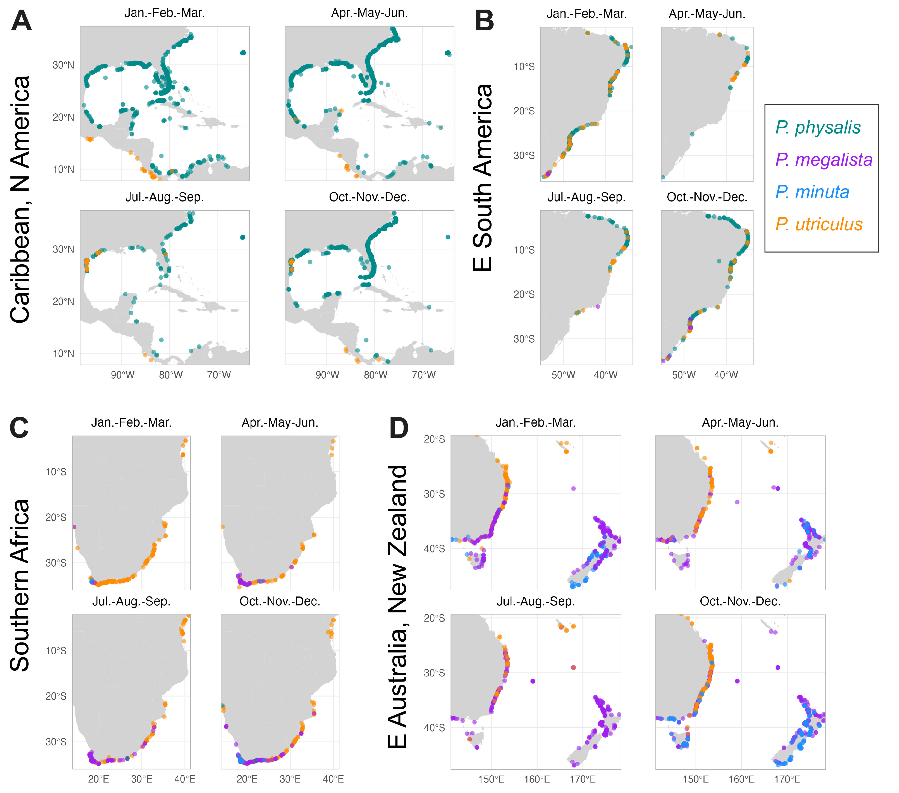

Dalila Destanović, Samuel H. Church, Namrata Ahuja, Maciej Mańko, Ramdhan Firdaus, Sarah Kingston, Adam Riggs, Ali Fox, Kylie Pitt, Amandine Schaeffer, Chris Simon, Inma Herrera, Mary Beth Decker, Casey W. Dunn

corresponding author: samuelhchurch@gmail.com, SHC

# Abstract

The organisms at the ocean surface, termed neuston, experience unique environmental conditions. Here we analyzed the spatiotemporal distribution of _Physalia_, known as Portuguese man-o'-war or bluebottles, recently revised to include at least five species with distinct but overlapping ranges. We first classified 3,599 images of _Physalia_ uploaded to the participatory science network iNaturalist, and used these as training data for two approaches: first, to fine-tune a machine learning model, and second, as a ground-truth dataset for a group of community labelers to classify the remaining images. Based on the combined annotation of more than 20,000 images, we describe species distributions over space and time at regions of range overlap (e.g. Eastern Australia, South Africa), and identify different seasonal dynamics leading to species-specific peaks in stranding each year. We characterize several regions that experience notable seasonal gradients (e.g. for _P. physalis_ in the Western Atlantic), and further show these gradients are repeated across ocean basins (e.g., _P. megalista_ peak in Oct.-Dec. at 30'S in the Pacific, Indian, and Atlantic oceans). For three species overlapping in the South Pacific, we unite these data with mitochondrial genomic data derived from open water collected specimens and use these to show that species inhabit different open ocean ranges that overlap and are repeated across sampling years. We additionally include new genomic data from _P. minuta_ in the South Atlantic, extending the previously known range of this species. Finally, we present a morphological comparison of live and preserved specimens of the five _Physalia_ species, distinguish aspects of their colony-level organization, and designate neotype material for _P. physalis_, _P. utriculus_, and _P. megalista_. The combination of thousands of labeled photographs, 168 publicly available mitochondrial genomes, and diagnostic morphological characters will facilitate future identification and allow for continued monitoring and research of this critical neustonic system.

# Introduction

Open ocean environments have recently been shown to host more diversity and population structure than previously thought [@norris2000pelagic; @peijnenburg2013high; @bowen2016comparative; @johnson2022speciation]. These results challenge assumptions about a well-mixed ocean and suggest instead that biological and environmental processes play a dynamic role in maintaining boundaries between populations. Many of these results have been framed in terms of biogeography, describing genetic distances across spatial gradients to test, among other things, the role of isolation by distance [@casteleyn2010limits; @mills2007global]. But spatial divisions can tell only one side of the story [@goetze2011population; @unal2010basin; @goetze2003cryptic]; temporal divisions, such as seasonal patterns, are also critical in shaping interactions. Cyclic fluctuations in ocean currents, winds, temperatures, and ecosystems play a significant role in defining species ranges and potential points of contact [@gaylord2000temperature; @white2010ocean; @sunday2012thermal]. These processes are particularly relevant to the ocean-surface community, termed the neuston, at the air-water interface. This unique assemblage represents one of the most enigmatic and understudied ecosystems in the ocean, and one that is uniquely imperiled by pollutants that accumulate at the ocean surface [@helm2021mysterious]. Exploring spatiotemporal dynamics in neustonic communities presents an ideal opportunity to dissect the relationship between oceanographic processes and biodiversity.

To test the role of temporal structuring of ocean communities, we require high-resolution data over time and space of species abundances. For many organisms, such data can be difficult to gather, given the massive distances to be monitored and the remote nature of open ocean environments. But for select organisms, participatory or citizen science can give us large sample sizes through crowd-sourced observations. This is true for _Physalia_ (Hydrozoa: Siphonophora), open ocean cnidarians that sail the ocean surface and regularly wash ashore. On the participatory science website iNaturalist, there are more than 20,000 photographs of _Physalia_ from dozens of countries and across all seasons. At least 96% were research grade at the time of download, meaning verified by two or more identifiers. The data are therefore largely reliable, and are associated with exact time and place. Analyzing patterns in the seasonal abundance of _Physalia_ globally presents an opportunity to unpack seasonal structure in biodiversity at the ocean surface. 

In our previous study of _Physalia_ diversity [@church2025population], we used population genomic data to show that there are at least five lineages in the open ocean, each with a unique oceanic range and identifiable morphology, four of which we identified as species; the fifth has since been described as _P. mikazuki_ [@yongstar2025physalia]. We further showed that within each species, there are patterns of regionally localized subpopulations with unique genomic signatures, as well as evidence for long-distance migration events between subpopulations. These species overlap in parts of their ranges, but it is unclear how species boundaries have been maintained. One open question is to what extent these species co-occur within the same season, or if they present distinct seasonal distributions that might reflect distinct source regions, or differential movement in response to ocean currents and temperature. Answering these questions is essential as  _Physalia_ represent a significant component of the neustonic ecosystem, serving as a key predator and fish-specialist [@damian2022characterizing; @purcell1984predation; @nunes2025predation]. They also have potentially significant impacts on human health and tourism, given the medical relevance of their sting when encountered in near-shore environments [@hewitt2026blowin]. Understanding seasonal fluctuations in the abundance of individual species, therefore, has direct implications for how to predict and manage human-_Physalia_ interactions.

Here we use a combination of machine learning and participatory science to identify and describe patterns in the abundance of _Physalia_ species around the world. We test for both seasonal gradients in beaching events and investigate regions of species biogeographic overlap to determine whether species exhibit differential peaks in abundance. For one such region, the Southwest Pacific, we incorporate new open ocean genetic sampling to connect patterns in strandings to open ocean ranges. With new beaching samples and iNaturalist observations from the South Atlantic, Indian, and Southeast Pacific, we expand the known range of _P. minuta_ previously only found in the Southwest Pacific Ocean. Finally, to aid the future monitoring of _Physalia_ across the globe, we present novel morphological characterizations of colony organization and architecture, along with newly designated type specimens for three species. We combine these descriptions with thousands of labeled photos and 168 annotated mitochondrial genomes for molecular barcoding. Taken together, our results present a comprehensive community toolkit to identify _Physalia_ around the world, which will advance our understanding and monitoring of _Physalia_ stranding events across our shared ocean. 

# Methods 

## Participatory science images

iNaturalist.org was accessed for participatory science observations on several occasions across the lifetime of the project, using the site's observation export tool. An initial dataset of 20,007 images was downloaded on June 4, 2025 and used for training, retaining research-grade observations with photographs (`taxon_id=117305`, `has[]=photos`, `quality_grade=research`, `identifications=any`, `verifiable=true`, `spam=false`). A final dataset of 20,734 images was downloaded on August 14, 2025 using the same query, except that observations of any quality grade were retained (`quality_grade=any`); all of these were classified, of which at least 19,989 (96.4%) were research grade at the time of download. In addition, datasets on other commonly observed beach species (hermit crabs, echinoderms) were downloaded on August 22, 2025 as a measure of observer effort (`taxon_id=47398` and `taxon_id=47548`, `quality_grade=any`, `identifications=any`, `verifiable=true`, `spam=false`). All datasets analyzed here are included at <https://github.com/shchurch/Physalia_spatiotemporal_patterns>. Images not associated with a precise location were excluded (30 images from the final _Physalia_ dataset); all remaining images carried a timestamp.

A subset of ~4,000 was examined manually and preliminarily assigned to species based on the characters described in Church _et al._, 2025 [@church2025population]. These were preferentially selected to include key regions of species overlap (New Zealand, Brazil, etc.) as well as regions with only one previously known species (Eastern North America, Hawai'i), to create a balanced and rich training dataset including multiple sizes, angles, and preservation conditions. From this subset, 2,706 images could reliably be identified to species and were selected as the initial training dataset.

## Image classification via semisupervised learning

The initial training dataset was used to fine-tune a pretrained model, google/vit-base-patch16-224-in21k (a Vision Transformer, ViT), using Python with PyTorch and the HuggingFace Transformers library. Model tuning was performed for 15 epochs, after which the model was redeployed to classify the remaining 17,163  images. High-confidence (>90%) images were examined for their distribution over geographic range, and images falling outside previously understood ranges for each species were manually examined. Labels were either accepted, reassigned, or images were marked as likely unidentifiable given current morphological understanding (for example, juvenile specimens with a globular float and few colony bodies were deemed indistinguishable). Range boundaries for inspecting outliers were originally described as follows: _P. physalis_, records occurring outside the Atlantic basin (Indian and Pacific Oceans, longitude > 30°E; northeastern Pacific, longitude < −100°W, latitude > 0°N; southeastern Pacific, longitude < −60°W, latitude < 0°S); _P. megalista_, records north of 15°S; _P. utriculus_, records in the North Atlantic (longitude −100° to 20°E, latitude 15°–70°N) and New Zealand region (latitude −49° to −33°S, longitude 165°–180°E); _P. minuta_, records north of 15°S or west of 110°E.. Confirmed new labels were then added to the original training dataset, and the process was repeated for two generations. This process resulted in a final training dataset of 3,599 manually confirmed images and 1,041 records flagged as unidentifiable.

A final image classification model was fine-tuned on the final training set, using an ensemble of three google/vit-base-patch16-224-in21k models with temperature scaling calibration and focal loss (γ = 2.0), for 10 epochs, using a 70/15/15 split for training, testing, and validating the training data. Final model accuracy was evaluated using a confusion matrix (@fig-classification C-D); overall accuracy on the held-out set was 83.8%. This model was deployed on the remaining images, of which 7,566 were assigned labels above a confidence threshold of >65% and were incorporated into the spatiotemporal dataset.

## Community labeling images

The final training dataset of 3,599 manually confirmed images was provided to the iNaturalist community, who initiated a project to relabel the remaining images around the globe. Authors S.H.C. and C.W.D. assisted the community in this work, responding to specific questions and comments on iNaturalist as tagged. iNaturalist community members determined the best course of action for relabeling, opting to use atlases for initial identifications based on previously understood ranges, and evaluating images in areas with known overlap. By August 14, 2025, 13,979 images had been labeled to species, at which point labels were downloaded and incorporated into the spatiotemporal dataset.

Final labels for the spatiotemporal dataset were determined by combining the training, classified, and community label datasets in sequence, each source taking precedence over the ones before it: manual training labels, an initial round of manual correction, model classifications above the confidence threshold, community identifications, and a final round of manual correction. Where an image carried a label from more than one source, the later source was used. Labels for images marked as unidentifiable during initial training were removed as potentially unreliable. A final manual inspection of geographic outliers (n=2,260) was performed to confirm the identity of any images that would extend the known range of species. After finding genetic evidence that the range of _P. minuta_ extends to the South Atlantic (see below), authors S.H.C. and D.D additionally re-examined manually corrected samples (679), as well as all observations from the South Atlantic Ocean (729) and Indian Ocean (1,158).

Neither iNaturalist nor machine learning-defined labels could differentiate between _P. utriculus_ and _P. mikazuki_ [@yongstar2025physalia; @yongstar2026physalia], as there is currently not enough information on the differences in their morphology for high-confidence species identification (see discussion below).

## Seasonal abundance characterization

To visualize potential seasonal patterns, we combined classified observations across years and visualized abundance in three ways: [1] spatially, across four three-month epochs of the year; [2] daily, counting observations within defined regions; and [3] calculating the median calendar day of observations across a grid to analyze spatiotemporal gradients. To account for potential confounding effects of iNaturalist user effort, we normalized to observations of abundant and commonly reported beach species (hermit crabs and echinoderms). Normalization followed two approaches: a raw ratio of daily _Physalia_ observations to proxy beach species, and a normalization using a generalized additive model (GAM) with a cyclic cubic spline fit to proxy species daily counts that accounts for seasonal trends. Further, comparing differences in species abundances in the same region provides an internal control for user effort, as iNaturalist observations were originally recorded agnostic to species.

## Genetic and phylogenetic analyses

### Sample collection

Specimens were collected in the Southwest Pacific and South Atlantic. The Southwest Pacific collections happened during two cruises aboard the Sea Education Association’s SSV Robert C Seamans. The first cruise took place from March 26th to May 3rd, 2024, from Lyttelton, Aotearoa, New Zealand to Pepe’ete, Tahiti, French Polynesia. The second cruise took place from April 3rd to May 16th 2025 from Lyttelton, Aotearoa, New Zealand to Mo’orea, French Polynesia. _Physalia_ was collected twice a day with 335 µm mesh neuston tows at a speed of 2 knots for 0.5 hour at 10:30 am and 10:00 pm, weather permitting. Specimens were separated from the rest of the zooplankton sample, measured individually, phenotyped for handedness, and photographed. Tentacle tissue was subsampled and preserved in a DNA shield at -20℃ (Zymo Research, Orange, CA, USA), while whole specimens were preserved in 100% ethanol. Additional beached specimens from this region were collected in Breaker Bay, Foxton Beach, and Lyall Bay. Also, we received one specimen from the Western Australian Museum collected in the Eastern Indian Ocean. The South Atlantic specimens were collected at Sandy Beach, Saint Helena, during two periods: September 24th, 2025, and January 11th to 20th, 2026. Specimens were stored in 100% ethanol and, for some, in formalin for morphological purposes, and photographed. Information on sequenced specimens can be found in Table S1 (`Supp_Table_ specimens.tsv`).

### DNA extractions

Samples later used for short-read Illumina whole-genome sequencing were stored in 100% ethanol and DNA Shield (Zymo Research, Orange, CA, USA). The same procedure was used for ethanol (10 samples) and DNA Shield-stored samples(10 samples). A piece of a tentacle was used as input for all of the  samples, except for one degraded sample from Saint Helena, where we used a piece of float (YPM-IZ-116019). DNA was extracted using the EZNA Mollusk Kit following the manufacturer’s instructions, with an overnight digestion step at 60℃. Yale Center for Genome Analysis processed the genomic DNA and prepared libraries for Illumina NovaSeq paired-end 150bp whole-genome sequencing (WGS) (10x coverage).

The 28 individuals collected on the 2025 Southwest Pacific cruise were sequenced on the Oxford Nanopore platform rather than by Illumina whole-genome sequencing. Because these libraries differ in error profile and read length, they were treated separately at several points below. Tentacle samples in DNA shield (Zymo Research, Orange, CA, USA) of these 28 individuals were extracted using Qiagen DNEasy Blood and Tissue kit (Qiagen, Hilden, Germany). If available, about 5 mg of tissue was miced and digested. Whole genomic DNA was quantified and qualified on a Nanodrop One (Thermo Fisher Scientific, Waltham, MA). The samples were then sequenced on Oxford Nanopore minION Mk1C and Mk1B platforms using the 24-barcode rapid PCR sequencing kit (SQK-RPB-114.24) on the ONT flow cell version FLO-MIN114 R10.4.1. We used a factory protocol with recommended reagents (New England Biolabs LongAmp Hot Start Taq 2X Master Mix NEB M0533, Ipswich, MA). Each sample was sequenced on two flow cells.

Raw sequencing reads for all 48 new WGS libraries generated for this study (28 Oxford Nanopore, 20 Illumina) are publicly available in the NCBI Sequence Read Archive under BioProject PRJNA1509992. Run and BioSample accessions for each specimen are given in Table S1 (`Supp_Table_specimens.tsv`).

## Read quality control and mitochondrial genomes assembly

 For subsequent analyses, we used previously published _Physalia_ WGS libraries (n=151), and added the new Southwest Pacific and South Atlantic samples. The raw reads were checked with a quality control pipeline, implemented in Snakemake [@molder2021sustainable] and available in this repository under `pipeline/`. The pipeline branches by sequencing platform, with the Illumina libraries handled under `pipeline/illumina/` and the Oxford Nanopore libraries under `pipeline/ont/`; the two differ in preprocessing, in the screens applied, and in how mitochondrial genomes were assembled.

For the Illumina libraries, we took the first 10 million read pairs from each library, trimmed them with Trimmomatic (default settings) [@bolger2014trimmomatic], and ran them through FastQC, Kraken2 (standard contaminant database) [@wood2019improved] and sharkmer v1.0.1 [@dunn2026sharkmer] (metazoa, cnidaria, and bacteria PCR primers; `-n 100 -k 31`). The reads were also mapped with BWA [@li2013aligning] to a human genome [GRCh38, GCA_000001405.15], to check for human contamination. Mitochondrial genomes were assembled directly from the trimmed reads using GetOrganelle (custom seed of siphonophore genomes, -R 10, --reduce-reads-for-coverage inf, --max-reads inf) [@jin2020getorganelle] and annotated with MITOS2 (--orih 0, --oril 0, --trna 0, --intron 0, --linear, -c 4) [@donath2019improved] and tRNAscan-SE (-O, -g gcode.invmito) [@chan2021trnascan].

The Oxford Nanopore libraries were basecalled in real time during the sequencing run by MinKNOW, running offline so that the run could proceed without a network connection at sea. MinKNOW also demultiplexed the samples and removed adapters, and filtered reads at its default mean quality threshold of Q8; only the reads passing that threshold were retained. Reads for each sample were then concatenated across MinKNOW's output files and across the two flow cells on which that sample was sequenced, giving one file per sample. No further preprocessing was applied: because adapters had already been removed on the instrument, no trimming step was used, and the contaminant and human-mapping screens run on the Illumina libraries were not run on these. We took the first one million reads from each library and ran them through FastQC and sharkmer with the same primer sets (`-n 100 -k 21`).

Mitochondrial genomes were assembled from the Oxford Nanopore libraries by a different route. Reads were first recruited by mapping to a reference set of siphonophore mitochondrial genomes with minimap2 (`-x map-ont`) [@li2018minimap2], the recruited reads subsampled with seqtk to a cap of one million reads that was not reached in practice, and assembled with Flye (`--nano-raw --genome-size 20k --meta`) [@kolmogorov2019assembly]. GetOrganelle was then run on the resulting assembly graph (`get_organelle_from_assembly.py -F animal_mt`) rather than on reads, and the assemblies annotated with MITOS2 and tRNAscan-SE as above. Assemblies were recovered for all 28 samples. These were used for species identification (below) but, because their quality varies relative to the reference mitochondrial genomes, were not deposited publicly; they are provided in the mitochondrial genome alignment in this repository.

Of the 171 mitochondrial genomes assembled from the Illumina libraries, 168 are deposited in GenBank. Two were withheld, being the two longest recovered, each approximately 420 bp above the modal genome length of 15,037 bp and with annotation tables inconsistent with the remainder, and one specimen (YPM-IZ-104465) already has a published mitochondrial genome (OQ957220.1).

### Phylogenetic analyses

Phylogenetic trees were built from four single markers — the mitochondrial _cytochrome oxidase I_ (_COI_) and 16S ribosomal RNA genes, and the nuclear 18S ribosomal RNA gene and internal transcribed spacer (ITS) region — and separately from whole mitochondrial genomes.

For the two mitochondrial markers, sequences were taken from the MITOS2 annotations of the assembled mitochondrial genomes, supplemented by sharkmer products for samples without an assembly. The two nuclear markers were recovered by sharkmer alone, for all samples in which sharkmer returned a product. Where a sample yielded more than one sequence for a marker, the longest was retained. One sample (SEA2025-Ph277) was excluded from the gene trees, as its assembly is locally damaged and it yielded no sharkmer product at any marker.

Published _Physalia_ and _Rhizophysa_ sequences were retrieved from GenBank on 5 August 2026 for each marker, excluding whole-genome and transcriptome assemblies and this study's own submissions, yielding 25 sequences for 16S, 4 for 18S, 80 for _COI_ and 53 for ITS. _Rhizophysa_ sequences were used as outgroups where available: 13 for 16S, 2 for 18S and 10 for _COI_, the last including accessions GQ120038, GQ120039, GQ120040, GQ120041 and AY937377. No _Rhizophysa_ ITS sequence is available, so the ITS tree is unrooted and is presented midpoint-rooted.

Sequences were aligned with MAFFT v7.525 [@katoh2013mafft] using `--adjustdirectionaccurately --auto`, and trees inferred with IQ-TREE 3.0.1 [@nguyen2015iq] using 1000 ultrafast bootstrap replicates [@hoang2018ufboot], with substitution models selected by ModelFinder under the Bayesian information criterion [@kalyaanamoorthy2017modelfinder]. The selected models were TN+F+I+R2 for 16S (199 tips), HKY+F for 18S (185 tips), TIM2+F+R3 for _COI_ (257 tips) and JC+R3 for ITS (239 tips). The single-marker trees are weakly resolved, with median bootstrap support ranging from 31 to 75 across the four, and are presented as supporting evidence rather than as independent results.

Two mitochondrial genome trees are presented. The first contains the 168 deposited genomes, so that the tree corresponds exactly to the deposited data (TVM+F+I+R3); a rooted version adds three _Rhizophysa_ mitochondrial genomes (KT809335, OQ957199, OQ957206) as outgroups (TVM+F+I+R4). A third tree, used to assign species rather than as a phylogenetic result in its own right, includes all 199 sequenced samples (GTR+F+I+R5) and is shown in Fig. S5. Alignment and inference settings are as above.

Samples for which no mitochondrial genome is deposited were assigned to species by their placement in this third tree, taking the majority species of the smallest clade containing the sample and at least one sample of known identity. This assigned 25 samples to _P. minuta_ and 3 to _P. megalista_. Every assignment was unanimous, in that all identified samples in the relevant clade were of the same species, but seven fall in clades with bootstrap support below 90% and are indicated in @fig-openocean.

Marker recovery from the Oxford Nanopore libraries was sparser than from the Illumina libraries: sharkmer returned 16S for 3 of the 28 samples and _COI_ for 6, against 18S for 10 and ITS for 15. No mitochondrial sequence from these samples is deposited.

## Morphological description

_Physalia_ specimens are often encountered on the beach after washing ashore, where their anatomy may be compromised by physical damage or decomposition, depending on stranding conditions. We sought to describe these animals from live specimens to better understand differences in the natural morphology and posture of _Physalia_ species as they appear floating in water. We collected and photographed _P. megalista_ and _P. minuta_ specimens from the North Island, New Zealand (May 2024), _P. physalis_ from Gran Canaria, Canary Islands (March 2025), and _P. utriculus_ from the Big Island, Hawai'i (April 2025) and observed macromorphological differences in colony-level features. We supplemented these observations with examination of fixed specimens and designated neotype material for the three species for which no type material currently exists. Additionally, to advance our understanding of _P. utriculus_ and _P. mikazuki_ in the Eastern Indian Ocean, we observed and photographed specimens from the south coast of Jawa, Indonesia.

# Results

## Identifying _Physalia_ species in images

Our analysis of a dataset of global observations of _Physalia_, using a hybrid semisupervised machine learning approach and community labeling approach, resulted in 16,453 of 20,734 images identified to species level (@fig-classification A). This approach first employed manual labeling of 2,706 images and iterative fine-tuning of a classification model to generate a training dataset of 3,599 images (1,096 _P. physalis_, 1,293 _P. utriculus_, 1,032 _P. megalista_, 178 _P. minuta_). These were used to tune a machine learning classification model and also provided as a ground-truth reference to community labelers on iNaturalist. The model resulted in 7,566 high-confidence classifications (threshold >65%, selected to balance assignments with accuracy), and the community made 13,979 assignments. This difference is likely due to the use of `atlases` (expected range maps) on iNaturalist to establish preliminary species IDs, which results in automatically assigned images that are then verified by the community of labelers. From the final dataset, 2,261 images that represented outliers from the known range of the species were manually confirmed by the authors, resulting in 794 corrections.

Comparing labeled images between the model and community labeling, we observed strong consistency, with 4,899 out of 5,022 joint observations being shared (97.6%; @fig-classification B). Model validation showed an accuracy >80% for all species even without filtering on confidence, as calculated using 15% of manually labeled images that were held out during training (@fig-classification C-D). Given the strong variation in image quality and composition, preservation of beached colonies, and the complex morphology of these colonial animals, we estimate this may be near the maximum possible accuracy. Visualizations of model attention (representing the pixels most highly weighted in making an assignment) show that the model is largely focused on the float and colony zones (@fig-classification E-F).

![**Integrating semisupervised learning and community labeling to assign species to thousands of images.** A, 20,734 images from iNaturalist were processed for species assignment. 2,706 images were manually labeled, then used as training data for iterative classification and labeling steps, resulting in a final training set of 3,599 images. These were provided as training data for an image classifier as well as community scientists via iNaturalist. Final assignments were inspected for geographic and temporal outliers. B, Correspondence between high confidence (>0.65) predictions and community assignments. C-D, Confusion matrix comparing model predictions to manual labels, shown as (C) number of images and (D) proportion, normalized to manual labels per class. E-F, Visual attention of the trained classifier on sample assigned images for (E) _P. physalis_ and (F) _P. megalista_. Image credit, **[TODO: image credit]**. G-H, Temporal (G) and spatial (H) distribution of the final labeled dataset of 16,453 images.](../figures/image_classification.png){#fig-classification}

## Seasonal dynamics in regions of range overlap

Our previous study describing species ranges had identified several regions of overlap between _Physalia_ species, raising questions about potential ecological overlap and mechanisms maintaining species barriers. To investigate the potential role of differential seasonal partitioning, we used the classified images to assess seasonal abundances in four regions, examining when observations fall in the year (@fig-seasonality-time) and where they fall in space (@fig-seasonality-space). The same panel letter denotes the same region in both figures: the Caribbean and North America (A), the Southwest Atlantic (B), Southern Africa (C), and the Southwest Pacific (D).

Our results show striking differences in seasonality and fine-scale ranges across species. In the Southwest Pacific (@fig-seasonality-time D, @fig-seasonality-space D), _P. minuta_ and _P. utriculus_ exhibit strong seasonal turnover in their observations. _P. minuta_ is virtually unobserved in Southern Hemisphere winter months (no observations in Jul.-Aug.-Sep.). We also find that in summer months (Jan.-Feb.-Mar.) _P. utriculus_ observations are frequent in Eastern Australia, but rare in New Zealand and Tasmania, and vice versa for _P. minuta_. _P. megalista_ is observed throughout the year, with a peak in Sep. and Oct. Strong overlaps between species in both space and time include between _P. utriculus_ and _P. megalista_ in Eastern Australia in Oct.-Nov.-Dec., and _P. minuta_ and _P. megalista_ in New Zealand in the same months.

These patterns are consistent across ocean basins. In Southern Africa (@fig-seasonality-time C, @fig-seasonality-space C) _P. megalista_ again shows a peak in Sep. and Oct., and is rare in Jan.-Feb.-Mar.  _P. utriculus_ and _P. minuta_ are less abundant in Jul.-Aug.-Sep., consistent with observations from the Southwest Pacific. These trends are robust to seasonal changes in iNaturalist user effort, as measured using abundant beach species (hermit crabs, echinoderms) as a proxy for observer activity. Seasonal patterns persisted or were even stronger when effort was taken into account- see, for example, observations of _P. utriculus_ in Southern Africa (Fig. S1): an anomalous day of high counts around the 116th day of the year is seen for both _P. utriculus_ and other beach species, corresponding to a local holiday. When this discrepancy is accounted for, seasonal trends become more apparent. _P. minuta_ had previously only been reported from New Zealand and Eastern Australia, but we recovered _P. minuta_ in the South Atlantic (see below). These observations are corroborated by iNaturalist observations in Southern Africa, which were manually validated by the authors here. _P. minuta_ and _P. physalis_ overlap in their seasonal observations in Southern Africa, therefore, Oct-Nov-Dec represents a period of four potentially concurrent species in that region.

![**Seasonal timing of observations across four regions.** (A) The Caribbean and North America, (B) the Southwest Atlantic, (C) Southern Africa, (D) the Southwest Pacific. Rings are species, from the center outward: _P. physalis_ (teal), _P. megalista_ (purple), _P. minuta_ (blue), _P. utriculus_ (orange). Sectors are five-day bins of the calendar year, combined across years, shaded by the number of observations relative to a uniform spread across the year for that species in that region. Observations are high-confidence labeled images, weighted by observer effort, estimated for each region from a cyclic model of daily beach-species counts. Unweighted and daily-weighted versions are shown in Fig. S2 and Fig. S3. Dashed ring and asterisk mark fewer than 50 observations, too few to calculate uniformity.](../figures/seasonality_time_norm_seasonal.png){#fig-seasonality-time width=100%}

In contrast to consistent signals across the Southern hemisphere, we observe distinct seasonal patterns for the same species between the Southern and Northern hemispheres. _P. physalis_ in the Caribbean and Western North Atlantic (@fig-seasonality-time A, @fig-seasonality-space A) shows a strong depletion in abundance in Jul.-Aug.-Sep., but at more southern latitudes (@fig-seasonality-time B, @fig-seasonality-space B), the same depletion in abundance is seen earlier (Apr.-May.-Jun.). Here turnover between species is again apparent: in the Gulf of Mexico, _P. utriculus_ is largely present when _P. physalis_ is at its lowest abundance in Jul.-Aug.-Sep.. Seasons of particular overlap include Jan-Feb-Mar in the Western South  Atlantic when _P. physalis_, _P. utriculus_, and _P. megalista_ can potentially be found.

{#fig-seasonality-space width=100%}

## Seasonal gradients across space and time

To examine seasonality across fine scales within a region, we visualized median day-of-year for observations across the grid for each species in the regions examined in the previous section (@fig-gradients). 

In Southern Africa, we visualized the seasonal gradients of _P. megalista_ and _P. utriculus_ (@fig-gradients C,D). The species’ peak occurrences happen in different parts of the year: _P. megalista_ peaks in Southern Hemisphere spring (Aug-Sep-Oct), and _P. utriculus_ in the summer to fall (Nov to Apr), following a replacement trend. This suggests that even though these two species may overlap in space and time, they have distinct annual peaks in abundance that do not overlap.  We also observe a latitudinal gradient in the distribution of _P. utriculus_ on the eastern coast, ranging from up north in Tanzania (July) to the southern coast of South Africa (Jan-Apr), but as there are few observations from Mozambique, it is unclear whether the specimens observed in Tanzania and those in South Africa are a part of the same transportation system.
In the Caribbean and North America (@fig-gradients A,B), we observe a clear gradient for _P. physalis_ from the Gulf of Mexico northward to the eastern coast of North America, ranging from late winter/early spring (Jan-Apr) to late summer (Jun-Sep) driven by the Gulf Stream, consistent with our previous study [@abedon2025surfacing]. _P. utriculus_ is observed in the Gulf of Mexico in the Northern Hemisphere fall (late Aug, Sep), a pattern similar to the replacement of _P. megalista_ and _P. utriculus_ in South Africa.
We have also visualized trends for _P. megalista_ and _P. utriculus_ in the Southwest Pacific, as well as _P. physalis_ and _P. utriculus_ in the western South Atlantic (Fig. S4A-D). _P. megalista_ follows a latitudinal gradient from north (Sep) to south (Apr) on the eastern Australian coast in the Southwest Pacific (Fig. S4A). The patterns observed for other species are more complex, and it is necessary to further study current patterns in the regions, as well as regions of high productivity, to interpret them.

![**Seasonal gradients across species and regions.** (A-D) Tiles indicate the median day observed for species observations in that area, colored by the calendar wheel at right. Grey hexagons hold fewer than three observations, too few to calculate a median. (A,B) The Caribbean and North America, for _P. physalis_ (A) and _P. utriculus_ (B). (C,D) Southern Africa, for _P. megalista_ (C) and _P. utriculus_ (D). Strong seasonal gradients can be observed, e.g., in _P. physalis_ northward up the W. Atlantic (A). Equivalent panels for the Southwest Pacific and the western South Atlantic are shown in Fig. S4.](../figures/seasonal_gradients.png){#fig-gradients}

## Open ocean ranges in the Southwestern Pacific

In combination with our analysis of beaching observations, we collected open ocean samples from the Southwest Pacific over multiple years and performed whole-genome sequencing to confirm their identity. We combined these with sequenced specimens collected from beaches in the same region to investigate the offshore components of their seasonality, given that this region has three overlapping species with distinct spatiotemporal patterns of stranding. 

Both _P. minuta_ and _P. megalista_ were collected from the open ocean east of New Zealand, with _P. minuta_ consistently (over multiple years) recovered west of ~150 deg W longitude, and _P. megalista_ observed further east, with the exception of a single _P. megalista_ observation at 168.6 deg W in 2025. These observations are suggestive of distinct open ocean ranges within and without the South Pacific gyre (@fig-openocean). 

Open-ocean transects were sampled at the same time of the year (April-May), therefore giving insight into interannual signals, but cannot provide data on other time periods. Collections at other times of the year may inform us of how their distribution changes, and how they move with the currents through the seasons. 

{#fig-openocean}

## Expansion of _P. minuta_ range

Sampling in our previous global analysis was much sparser in the Southern than the Northern Hemisphere. To close this gap, we collected live specimens from Saint Helena, observed their morphology, and genetically sequenced them. Our results showed that four out of five sequenced samples were _P. minuta_, and one was _P. megalista_ (Fig. S5). _P. minuta_ was previously only observed in the Southwestern Pacific and considered to be a species with a tighter regional range. Finding it in the South Atlantic indicates its range is larger than previously understood, at least in rare occurrences.
Based on these results, we performed a detailed examination of potentially missed observations of _P. minuta_ out of the expected range on iNaturalist. We confirmed isolated stranding events in November 2019 in Chile (SE Pacific) and in February 2018 in Western Australia. In Southern Africa the record is not isolated but is strongly seasonal: 23 of 25 observations fall between October and January, with single records in April and September and none from May to August. These are consistent with a larger open ocean range in the Southern Pacific, Indian, and Atlantic oceans for _P. minuta_. 

## Morphological characterization of species

We collected, observed, and photographed live (@fig-morphology A-I) and fixed (@fig-morphology J-U) specimens of four species that, in combination with the recent description of _P. mikazuki_, establish features for morphological identification. We also propose common names for each species. Based on these results, we present the shared characters and diagnoses of species:

![**Comparative morphology of live and fixed specimens of _Physalia_.** (A-E) Lateral views of five _Physalia_ colonies, specimens **[TODO-8: specimen IDs, #2]**. Left-handed specimens have anterior to the left, when viewing the side of the float bearing the main zone of the colony. (F-I) Posterior view, showing a typical floating posture with the posterior and main zones held parallel to the surface, specimens **[TODO-9: specimen IDs, #2]**; no live posterior view is available for _P. mikazuki_. (J-N) Type material for each of the five species, viewed laterally, specimens **[TODO-10: specimen IDs, #2]**. Asterisk indicates neotype material designated here. (O-U) Additional specimens examined. Panels E and N are republished images of _P. mikazuki_ [@yongstar2025physalia]. Panels N and U are not to scale. Scale bars = 1cm.](../figures/morphology_species_comparison.png){#fig-morphology}

### Proposed common names
_Physalia_ have many common names across languages [@pugh2019history], several of which refer to a specific kind of Portuguese sailing ship, the man-o-war or caravala. In the Pacific, especially Australia, _Physalia_ are also referred to as bluebottles, evocative of their striking color, and of their 'message-in-a-bottle' floating behavior. The common name Portuguese man-o-war has proven problematic, however, as the reference to the Portuguese ship is easily confused with a comment about their biogeography. In reality, the only _Physalia_ species known from Portugal is _P. physalis_, which is likely also the species to which the common name man-o-war was originally attributed.
To rectify this situation, and to provide a standard set of English common names that can be used to refer to these species worldwide, we propose the following:

- for _Physalia_, we propose the common name "bluebottles"
- for _P. physalis_, we propose this species retains the name "Portuguese man-o-war"
- for _P. utriculus_, the most widespread species and most abundant in English-speaking parts of the Pacific, we propose the name "common bluebottle"
- for _P. minuta_, we propose the name "little bluebottle"
- for _P. megalista_, distributed around the southern tips of continents, we propose the name "southern bluebottle"
- For _P. mikazuki_, several names have already been proposed, including Japanese man-o-war, crescent helmet man-o-war, and crescent moon-o-war [@yongstar2026physalia]. This species is found outside of Japan (including Mexico, Pakistan, and elsewhere), and is also not the only or even most commonly collected _Physalia_ species in Japan. We concur with the recently suggested "crescent helmet", and use the name "crescent helmet bluebottle" for consistency with the names of the other Indo-Pacific species above.

### _Physalia_ (bluebottle) characteristics across species 

![**Colony organization across _Physalia_ species.** (A-C) (A) _Physalia_ colonies are made up of a float, crest, and two colony zones (posterior and main), each made up of clusters of zooids. (B) Clusters contain tripartite groups, arranged on branches, diagram modified from [@totton1960studies]. (C) Tripartite groups contain a gastrozooid, gonodendron, and a tentacle with an associated palpon. (D-H) Images of main zones from each species, all identifiable palpons are false-colored in orange to highlight position. Specimens **[TODO-11: specimen IDs, #2/#7]**; panel H is a republished image of _P. mikazuki_ [@yongstar2025physalia] and is not to scale. (I-M) Proposed cluster arrangements across species, showing only palpon attachment points to highlight differences in organization, in the same species order as D-H. The question mark in M indicates that the arrangement for _P. mikazuki_ is provisional, inferred from a single published image.](../figures/colony_organization.png){#fig-colony width=68%}

While _Physalia_ colonies are often illustrated with the tentacles, palpons, and other zooids draped below the colony ventrally (as seen in the lateral view in @fig-morphology A-E), we observe in live specimens another posture common to all species (@fig-morphology F-I). In this posture, the posterior zone is flared opposite the main zone (e.g., to the left for right-handed colonies), and the main zone is pulled parallel to the surface of the water. In this arrangement it is apparent that large gonodendra are borne on the ventral side of clusters, such that they hang below the colony (e.g., @fig-morphology H), while palpons and tentacles are borne on the dorsal side, such that they insert nearest the surface (e.g., @fig-morphology I). When seen from above, the float may have a sinuous appearance, especially for specimens of _P. utriculus_ (Fig. S6A).

Historically, one of the challenges to defining morphological differences across specimens was in discerning differences in maturity from differences across populations. This is particularly difficult when considering tentacle numbers. Here we present the following descriptive statements as a paradigm that allows us to address this challenge: [1] As described by Totton [@totton1960studies], we consider all _Physalia_ colonies to consist of clusters (Totton's  "cormidia", see Munro et al for discussion of terminology [@munro2019morphology]) composed of tripartite groups (@fig-colony). Within each cluster, there is a primary tripartite group with branches of additional groups added laterally (@fig-colony B). Each tripartite group consists of a palpon and associated tentacle, a gastrozooid, and a gonodendron (@fig-colony C). [2] While all tentacles are associated with a palpon [@totton1960studies], we observe that major tentacles are associated with prominent palpons that can be easily identified, while very small tentacles may have reduced palpons. [3] We define an axis of tentacle maturity that ranges from small tentacles with tentilla spaced apart, appearing as beads on a string (**[TODO: panel]**), to major or major tentacles that have tightly packed tentilla and a coiled appearance.

Using this paradigm, we can define differences in the colony-level organization across species. First, by observing the position of predominant palpons associated with major tentacles, we identified clusters along the main zone of the colony (@fig-colony D-H). Based on the position of these clusters, we observed a primary difference between _P. physalis_ and other species is that in the former, clusters are on independent extensions of the outer wall of the float. In _P. megalista_, _P. minuta_, and _P. utriculus_, clusters are typically borne primarily on one extension, though in _P. megalista_ this may be divided into two or more, with one larger than the rest. _P. minuta_ differs from _P. megalista_ and _P. utriculus_ in having multiple palpons and associated tentacles of a similar maturity on the extension. In contrast, _P. megalista_ and _P. utriculus_ show a strong gradient of size extending anterior and posterior to the largest palpon. In typical _P. utriculus_ colonies, adjacent palpons and tentacles are much smaller than the central palpon and tentacle (though as mentioned, we observe specimens from Indonesia with more mature adjacent clusters).

### _Physalia physalis_, Portuguese man-o’-war (@fig-morphology A, F)

Large _P. physalis_ colonies can typically be distinguished from other species by their relatively large crest, running nearly the length of the float, that may be raised to a height as large as the float, and by the main zone of the colony that can have as many as seven clusters of zooids [@totton1960studies], each with a principal palpon and associated large tentacle. In a typical floating posture, there is often no visible gap between the main and posterior zone of the colony (@fig-morphology F). Clusters are borne on separate extensions of the outer float, which are distributed along the anterior-posterior axis of the body.

Small _P. physalis_ may share some characteristics associated with other species, in particular _P. utriculus_. These may reflect shared patterns of growth, for example, small _P. physalis_ colonies may also have a single prominent tentacle. Across all species, the float and crest are muscular and can rapidly change shape through contraction, which may lead to postures that are similar to other species. For example, if the anterior end of the float is extended, _P. physalis_ may appear to have the anterior projection associated with _P. megalista_. In this paper we have endeavored to describe the typical postures for each species that may reflect underlying differences in tissue-level anatomy.

_P. physalis_ colonies vary in color from blue, to pink, purple, and green, but specimens from the South Atlantic and Caribbean Sea in particular achieve a bright pink coloration that is not known from other species of _Physalia_ (Fig. S7A-B). Colonies from both the North and South Atlantic may have reddish gastrozooids, also unique to _P. physalis_ (Fig. S7A, D). Other colonies have dark blue, purple, or blue-green gastrozooids and palpons, while gonodendra are light purple. The apex of the crest is often pink, but may have no obvious coloration. The large float is typically shaded blue or pink, and is not glassy or strongly opalescent.

Neotype specimen: YPM-IZ-110254

### _Physalia utriculus_, common bluebottle (@fig-morphology B, G)

In our previous publication, _Physalia utriculus_ comprised two well-supported sister lineages, labeled B1 and B2 in Church et al. (2025). The neotype presented here for _P. utriculus_ (YPM-IZ-110777) is a member of the B1 lineage; B2 was recently described as a separate species, '_P. mikazuki_' by Yongstar et al. (2025) [@yongstar2025physalia; @yongstar2026physalia]

The most reliable positive indicator of the lineage of _P. utriculus_ and _P. mikazuki_ is the presence of bright yellow coloration on the distal tip of gastrozooids (@fig-morphology B inset). Other than the distal tip, gastrozooids are typically a bright blue, as are palpons and large tentacles, while gonodendra are light purple (Fig. S6B). Crest coloration varies from pink to blue or no color (Fig. S6). The anterior apex of the float may be colored green, yellow, or blue (Fig. S6A, C, D). Excluding the crest and anterior apex, coloration on the float is usually absent, and observation of a glassy transparent float is usually indicative of _P. utriculus_ (though very recently surfaced specimens of all species have glassy, globular floats). The float of _P. utriculus_ may appear curved or S-shaped when viewed dorsally, though in live animals this can change quickly as the muscles in the float contract and relax.

_P. utriculus_ shares a strong central organization of the main zone with _P. megalista_. All zooids appear to be borne on a single extension of the outer float of the colony, in contrast to _P. physalis_ that has multiple extensions. Small individuals of _P. utriculus_ may also resemble _P. minuta_ due to glassiness of the float and size, but they do not share the central organization of the main zone. 

#### _Physalia mikazuki_, crescent helmet bluebottle (@fig-morphology E, N)

The description by Yongstar et al of _Physalia mikazuki_ [@yongstar2025physalia; @yongstar2026physalia] specimens (B2 lineage) indicates many shared morphological features with _P. utriculus_ specimens (B1 lineage), such as the distinct bright yellow coloration of the gastrozooid distal tip, bright blue gastrozooids, light purple gonodendra, variable crest and body coloration with a glassy float (Fig. S6, Fig. S8). The most prominent characteristic differentiating _P. utriculus_ from _P. mikazuki_ is the number of major tentacles. _P. utriculus_ are often associated with the presence of a single major tentacle, while _P. mikazuki_  specimens have multiple. Genetic data have confirmed that rare _P. utriculus_ individuals have >1 tentacle (Fig. S9), and it has been suggested since at least 1910 that tentacle number can vary across colonies of _P. utriculus_ [@kawamura1910bozunira; @pugh2019history]. Therefore, the tentacle number alone should be treated with caution as a diagnostic character. Here we suggest that a more robust feature that appears to be distinct is the colony arrangement of zooids. In _P. mikazuki_, the main zone of the colony of the specimen shown in the original description has multiple clusters of zooids born from distinct extensions of the float (@fig-colony H, M). This is consistent with what we observed in the larger of the two fixed specimens that have been sequenced for genomic analysis (@fig-morphology U).

Furthermore, one trait noted as distinct for _P. mikazuki_ in the Yongstar description is the number of zooid clusters in the main and posterior zone. However, the number of clusters has not been counted in the _P. utriculus_ or other _Physalia_ spp. across growth forms or its range, and it is possible this character varies with natural growth, as is true of other features of _Physalia_ colonies  [@totton1960studies]. Additionally, the Yongstar description noted a gastrozooid morphology that may be different between _P. mikazuki_ and _P. utriculus_ [@yongstar2025physalia; @yongstar2026physalia], however, gastrozooids are highly elastic due to their function, and much of the variance depends on how they are contorted at the time of fixation or observation, making them unreliable for species diagnoses.

Here we report observations of colonies that match the described morphology of _P. mikazuki_ , with dense main zones of the colony bearing multiple major tentacles and associated palpons, on colonies with yellow-tipped gastrozooids (Fig. S8). These specimens, observed alive off the southern coast of Indonesia, vary in size (from ~3 to ~10 cm total float length), suggesting this is not correlated with the overall size of the colony. We hypothesize that, if these features prove reliable for _P. mikazuki_ identification, the range of this lineage extends throughout the Pacific and Indian Oceans, consistent with preliminary indicators from barcode data (MK084614.1), and our previous work [@church2025population].

### _Physalia minuta_, little bluebottle (@fig-morphology C, H)

_P. minuta_ was described in detail in our previous manuscript [@church2025population], but here we add the following observations: The float of beached and fixed specimens often has an elongated cylindrical shape (@fig-morphology L, R). In contrast to _P. utriculus_, _P. minuta_ colonies commonly have multiple principal tentacles and associated palpons at apparently similar levels of maturity, but unlike both _P. utriculus_ and _P. mikazuki_, they do not have brightly yellow-tipped gastrozooids. Colony bodies are born from a single extension of the outer wall of the float, such that the main zone of the colony has a "bunched" appearance, as opposed to elongated along either the dorsal/ventral or anterior/posterior axis. The combined characters of multiple large tentacles and palpons, large gonodendra (indicating a mature colony), and a small size (around **[TODO-22: size threshold, #2]** cm) is strongly indicative of _P. minuta_. 

Zooid and tentacle coloration varies from bright blue to dark blue-green; gastrozooids may have pale cream-colored distal tips (Fig. S10B). The float is typically without color except for the anterior apex, which may be green (Fig. S10A, C). In live specimens, the crest may be raised (@fig-morphology C), but in beached or fixed specimens it is typically fully relaxed (@fig-morphology R).

### _Physalia megalista_, southern bluebottle (@fig-morphology D, I)

_P. megalista_ is best recognized by the shape of the float and crest. In typical specimens, the float is elongated, with a prominent projection of the float beyond the anterior point of insertion of the crest (i.e., the crest is "incomplete"). In a relaxed posture, this projection of the float may appear shorter (@fig-morphology D), but when disturbed, the muscles are contracted such that the anterior projection is raised perpendicular to the water (@fig-morphology I). It is common to find specimens of _P. megalista_ in this position on the beach. Another common posture has both the anterior and posterior apices of the flared on the opposite side of the main zone, giving the float a "horned" appearance (Fig. S11B). The crest of _P. megalista_ is distinct in having a crimped appearance along the dorsal surface (@fig-morphology D).

_P. megalista_ may have one or multiple prominent tentacles. These are generally born from one extension of the outer float, though in large specimens there may be adjacent smaller extensions (Fig. S11A). Like _P. utriculus_, the tentacles and palpons of _P. megalista_ exhibit a strong central organization such that the most distal tentacle and palpon are the largest, and those adjacent to the anterior and posterior are progressively smaller. There is also often a prominent gap between the posterior and main zone, as in _P. utriculus_ (@fig-morphology I). Unlike most _P. utriculus_, however, the main zone of the colony typically has more tentacles and palpons at late stages of maturity (@fig-morphology I).

Zooid and tentacle coloration is typically a dark blue-green, with palpons more green than tentacles. In some specimens in the South Atlantic, minor tentacles may have red coloration (Fig. S11C). The float is often opalescent purple and blue-green, and rarely glassy. The crest often has a lavender apex with green at the bases of the septae. 

Neotype specimen: WAM-Z88480

# Discussion

As new _Physalia_ species are described from the open ocean [@church2025population; @yongstar2025physalia; @yongstar2026physalia], it becomes critical to provide resources to facilitate their identification and monitoring. To accomplish this purpose, we have provided here an integrated dataset of thousands of classified photographs, detailed descriptions of morphology, curated reference panels of genes and mitochondrial genomes, and maps of the ranges and seasonality of _Physalia_ species. Together, this toolkit can be used by citizen scientists, naturalists, and researchers across the globe, including in undersampled regions, such as South and Southeast Asia, Eastern Africa, parts of South America. Our hope is that morphological descriptions and spatiotemporal data will boost interest and accuracy of worldwide iNaturalist community efforts, and advance future efforts to understand the ranges, seasonality, and diversity of _Physalia_. 

Our results show that four _Physalia_ species (_P. physalis_, _P. utriculus_, _P. minuta_, _P. megalista_) have distinct seasonal patterns and cross-basin ranges. In each case, there are notable species-specific patterns as well as periods of significant overlap in space and time. For example, in the Southwestern Pacific, we observe that _P. utriculus_ and _P. minuta_ share seasonal patterns of peak abundance in the Southern Hemisphere summer months, but their ranges are quite distinct, with _P. utriculus_ nearly absent from New Zealand beaches but highly abundant in Eastern Australia, while _P. minuta_ shows the reverse pattern. _P. megalista_ in contrast is abundant in both locations and displays a distinct seasonal pattern of abundance. The result is that the dominant species found on a given beach cycles over time. Similar patterns of turnover are observed between _P. megalista_ and _P. utriculus_ in Southern Africa, and  _P. physalis_ and _P. utriculus_ in the Gulf of Mexico. Our exploration of median day-of-year of observations shows a latitudinal gradient throughout a year for some species (_P. megalista_ in Eastern Australia, _P. utriculus_ in Southern Africa, _P. physalis_ in North America). The observed patterns are likely a result of transport processes governed by major currents (e.g. Eastern Australian Current, Agulhas Current, Gulf Stream). More detailed regional surveys across species are needed to understand what drives the observed spatiotemporal patterns. .

Environmental processes that influence the ranges of _Physalia_ have been the subject of significant research, but their focus is largely on the processes that bring adults to shore where they can have significant economic and health implications [@macias2021model; @bourg2022driving;  @headlam2020insights; @bourg2024ocean; @roca2025unravelling; @martins2024unravelling; @fierro2021new; @carvalho2026spatiotemporal; @hewitt2026blowin]. In adults, movement is mediated by interactions of seasonal wind patterns, gyres, eddies, and currents, but at juvenile stages _Physalia_ spend a part of their life cycle under the water surface [@totton1960studies]. Their reproductive structures detach from the floating animal, then sink to a certain depth where they spawn and fertilize [@richter1907entwicklung; @steche1907genitalanlagen; @totton1960studies; @oguchi2024physalia].  _Physalia_ larvae spend an unknown amount of time in the water column in a pelagic phase until they inflate a float, which raises them to the ocean surface [@totton1960studies]. Depending on the depth at which the embryo forms, and how fast they emerge to the surface, their movement may be influenced by the subsurface oceanographic processes for a part of their life cycle. To understand how species follow distinct spatiotemporal trends, it will be critical to learn more about their reproductive biology, including finding gametes or larvae at depth to estimate dispersal. Additionally, it may be that seasonal abundance is largely indicative of the presence of preferred prey (generally fish) of each species and life stage. More research on differences in prey specificity and gut contents will shed light on how distinct patterns of seasonality reflect specialization on distinct fish populations.

To advance further studies of different aspects of _Physalia_ biology, we also provide morphological descriptions of four species (_P. physalis_, _P. utriculus_, _P. minuta_, and _P. megalista_), and a discussion on recently described _P. mikazuki_. Despite this, several key questions about the morphological differences in _Physalia_ still remain unanswered, particularly around the complex lineage of yellow-mouthed species like _P. utriculus_ and _P. mikazuki_. Further studies of their reproduction, development, growth patterns, and variation across their ranges will be crucial in establishing how genetic variation tracks morphological variation in coloration, tentacle and zooid number, and overall colony architecture.  In particular, we reiterate the caution of previous authors [@totton1960studies; @pugh2019history] that, because certain traits vary throughout growth and development, studying the morphology of different life cycle stages across species is essential to understand what fixed differences are between lineages. Without such data, we find it difficult to diagnose specimens of _P. utriculus_ from their sister lineages based on the number of tentacles, zooids, or shape of the gastrozooids alone. 

Further exploration of the range and seasonality in the broad _P. utriculus_ lineage in particular has great potential to advance efforts to understand their biology. _P. utriculus_ has the broadest range of all species, from Texas (USA) to the Pacific coast of Ecuador, and has corresponding patterns of regional diversity in genetic subpopulations [@church2025population]. Studying the processes that allow a lineage to remain cohesive across such vast geographic ranges has the potential to shed light on what drives dispersal and gene flow across ocean basins. At the same time, evidence that a sister lineage (_P. mikazuki_) with similar morphology overlaps maintains a distinct and identifiable genotype despite strong overlap in ranges suggests that barriers to gene flow can arise in open waters [@church2025population; @yongstar2025physalia]. Further research to distinguish the proximal causes of these barriers can shed light on the origins of the complex and fascinating neustonic community.    

# Data availability

Mitochondrial genomes are deposited in GenBank under accessions **PZ224317–PZ224484** (n=168). Nuclear 18S sequences are deposited under **PZ802573–PZ802753** (n=181). Nuclear ITS sequences are deposited under accessions **PZ804143–PZ804328** (n=186).

Mitochondrial genomes were assembled for the whole-genome-sequenced Illumina samples only. The 2025 open ocean samples were sequenced with Oxford Nanopore, and neither their mitochondrial genome assemblies nor the mitochondrial gene markers recovered from them met the quality threshold for deposition; no mitochondrial sequence from those samples is deposited. Those samples are represented in GenBank by their nuclear 18S and ITS sequences, and their species identifications derive from the mitochondrial genome tree provided in the repository below as alignments and treefiles.

Raw whole-genome sequencing reads for the 48 new specimens in this study (28 Oxford Nanopore, 20 Illumina) are deposited in the NCBI Sequence Read Archive under BioProject **PRJNA1509992** (SRA study **SRP725477**), comprising Illumina and Oxford Nanopore runs **SRR40085724–SRR40085779** (n=56 runs, including 8 specimens each sequenced across two Illumina flow cells) and BioSample accessions **SAMN62283094–SAMN62283141** (n=48). Per-specimen run accessions are given in Table S1 (`Supp_Table_specimens.tsv`).

All alignments, tree files, analysis code, and the labeled image dataset are available at <https://github.com/shchurch/Physalia_spatiotemporal_patterns>.

# Acknowledgements
Special thanks to the students and professional crews of SEA cruises S314 and S321 aboard the
SSV Robert C Seamans (Marine Biodiversity and Conservation 2024 and 2025), in particular:
Taylor Finn, Anneka Pitera, Jocelyn Rivera, Mya Williams, Aimee Bousquet, Ana Hoffman Sole,
Gabriela Carttar, and Robin Muse. We thank the Western Australian Museum, Tasmanian Museum and Art Gallery, and the Field Museum of Natural History for loaning specimens. Should we thank the folks who hosted Casey at Saint Helena too??

